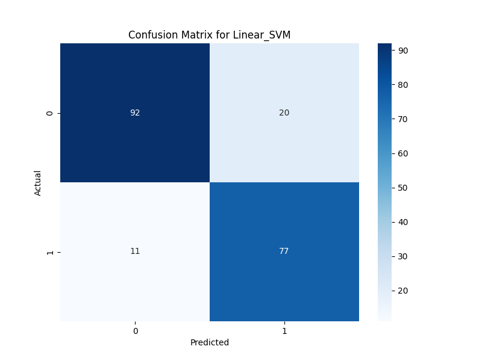
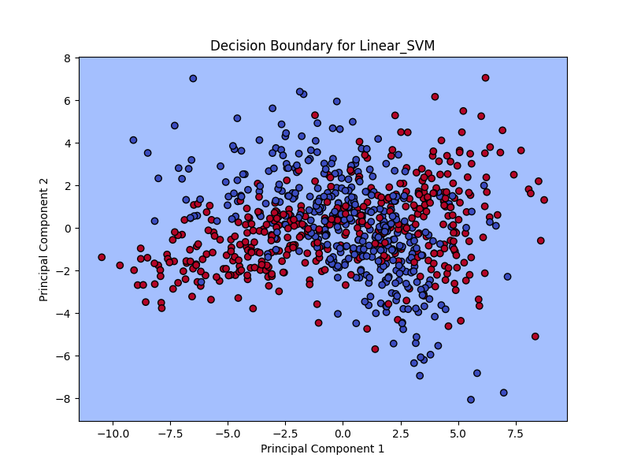
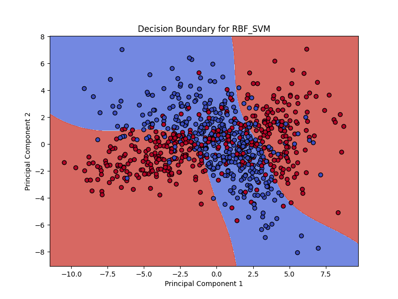

# End-to-End SVM Classification Project for MLOps

This project provides a full Proof-of-Concept (POC) for training and serving Support Vector Machine (SVM) models with Linear and Radial Basis Function (RBF) kernels. It is designed to showcase a complete MLOps workflow, from data generation and model training to experiment tracking with MLflow and deployment via a REST API.

## Table of Contents
- [Introduction to Support Vector Machines (SVM)](#introduction-to-support-vector-machines-svm)
- [SVM Kernels](#svm-kernels)
  - [Linear Kernel](#linear-kernel)
  - [Radial Basis Function (RBF) Kernel](#radial-basis-function-rbf-kernel)
- [Mathematical Formulation](#mathematical-formulation)
- [Industry-Level Use Cases](#industry-level-use-cases)
- [Project Structure](#project-structure)
- [Installation Guide](#installation-guide)
- [How to Use](#how-to-use)
  - [1. Data Generation](#1-data-generation)
  - [2. Model Training with MLflow](#2-model-training-with-mlflow)
  - [3. Running the Inference API](#3-running-the-inference-api)
- [Model Performance and Results](#model-performance-and-results)
  - [Performance Metrics](#performance-metrics)
  - [Confusion Matrices](#confusion-matrices)
  - [Decision Boundaries](#decision-boundaries)
- [Conclusion](#conclusion)

---

## Introduction to Support Vector Machines (SVM)

Support Vector Machine (SVM) is a powerful and versatile supervised machine learning algorithm used for both classification and regression tasks. However, it is most commonly used in classification problems. The core idea of SVM is to find a hyperplane in an N-dimensional space (where N is the number of features) that distinctly classifies the data points.

### How it Works: Hyperplanes and Margins

The goal of the SVM algorithm is to find the optimal hyperplane that best separates the classes. The "best" hyperplane is the one that has the largest margin, which is the distance between the hyperplane and the nearest data points from either class. These nearest data points are called **support vectors**, as they are the critical elements in the dataset that support the definition of the hyperplane.


By maximizing the margin, the SVM classifier is more likely to have better generalization performance on unseen data.

## SVM Kernels

SVMs can also perform non-linear classification using a technique called the **kernel trick**. The kernel trick involves transforming the data into a higher-dimensional space where a linear separator can be found. This is done without explicitly computing the coordinates of the data in this higher-dimensional space, which would be computationally expensive.

### Linear Kernel

The linear kernel is the simplest kernel and is used when the data is linearly separable. It is a dot product of the input vectors.

**Equation:**

\[ K(x_i, x_j) = x_i^T x_j \]

### Radial Basis Function (RBF) Kernel

The RBF kernel is a popular choice for non-linear data. It can map the input space into an infinite-dimensional space, making it suitable for complex, non-linear relationships.

**Equation:**

\[ K(x_i, x_j) = \exp(-\gamma \|x_i - x_j\|^2) \]

Where \(\gamma\) (gamma) is a parameter that defines how much influence a single training example has. The larger the \(\gamma\), the closer other examples must be to be affected.

## Mathematical Formulation

For a binary classification problem with labels \(y_i \in \{-1, 1\}\), the SVM algorithm aims to solve the following optimization problem:

**Minimize:**

\[ \frac{1}{2} \|w\|^2 + C \sum_{i=1}^{n} \xi_i \]

**Subject to:**

\[ y_i(w^T x_i + b) \ge 1 - \xi_i, \quad \xi_i \ge 0 \]

Where:
- \(w\) is the normal vector to the hyperplane.
- \(b\) is the bias term.
- \(C\) is the regularization parameter, which controls the trade-off between maximizing the margin and minimizing the classification error.
- \(\xi_i\) are the slack variables that allow for some misclassifications (soft margin).

## Industry-Level Use Cases

- **Image Classification:** SVMs are used for image recognition tasks, such as facial recognition and object detection.
- **Bioinformatics:** Used for protein classification and cancer classification based on gene expression data.
- **Text Classification:** Used for sentiment analysis, spam detection, and document categorization.
- **Handwriting Recognition:** SVMs can be used to recognize handwritten characters.

## Project Structure

```
svm/
├── data/
│   └── synthetic_data.csv
├── models/
│   └── svm_pretrained_1756968483.joblib
├── plots/
│   ├── confusion_matrix_Linear_SVM.png
│   ├── confusion_matrix_RBF_SVM.png
│   ├── decision_boundary_Linear_SVM.png
│   └── decision_boundary_RBF_SVM.png
├── utils/
│   └── io_utils.py
├── .git/
├── mlruns/
├── generate_data.py
├── train.py
├── serve_fastapi.py
├── requirements.txt
├── LICENSE
└── README.md
```

## Installation Guide

1.  **Clone the repository:**
    ```bash
    git clone <your-repo-url>
    cd svm
    ```

2.  **Create a virtual environment:**
    ```bash
    python -m venv venv
    source venv/bin/activate  # On Windows, use `venv\Scripts\activate`
    ```

3.  **Install the required packages:**
    ```bash
    pip install -r requirements.txt
    ```

## How to Use

### 1. Data Generation

First, generate the synthetic dataset by running the `generate_data.py` script:

```bash
python generate_data.py
```

This will create a `synthetic_data.csv` file in the `data` directory.

### 2. Model Training with MLflow

To train the SVM models and track the experiments with MLflow, run the `train.py` script:

```bash
python train.py
```

This script will:
- Train both a Linear SVM and an RBF SVM.
- Log the model parameters, metrics, and artifacts (the trained model and plots) to a local `mlruns` directory.

To view the MLflow UI, run the following command in your terminal:

```bash
mlflow ui
```

This will start a local server (usually at `http://localhost:5000`) where you can view and compare your experiment runs.

### 3. Running the Inference API

To serve the trained RBF SVM model via a REST API, run the following command:

```bash
uvicorn serve_fastapi:app --reload
```

This will start a FastAPI server. You can access the API documentation at `http://localhost:8000/docs`.

To make a prediction, you can send a POST request to the `/predict` endpoint with a JSON payload containing 10 feature values:

```bash
curl -X POST "http://localhost:8000/predict" -H "Content-Type: application/json" -d '{"features": [0.5, 0.2, -0.1, 1.2, -0.5, 0.8, -0.3, 0.6, 0.9, -1.1]}'
```

## Model Performance and Results

### Performance Metrics

| Model        | Accuracy | Precision | Recall | F1 Score |
|--------------|----------|-----------|--------|----------|
| Linear SVM   | 0.8450   | 0.7938    | 0.8750 | 0.8324   |
| **RBF SVM**  | **0.9200**   | **0.9091**    | **0.9091** | **0.9091**   |

As we can see from the results, the RBF kernel outperformed the linear kernel on this synthetic dataset, which suggests that the data has non-linear relationships.

### Confusion Matrices

**Linear SVM:**



**RBF SVM:**


### Decision Boundaries

These plots show the decision boundaries of the models in a 2D space created using PCA for visualization.

**Linear SVM:**



**RBF SVM:**



## Conclusion

This project demonstrates a complete, end-to-end workflow for a machine learning project. It covers data generation, model training, experiment tracking, and deployment, which are all critical components of a robust MLOps pipeline. This POC can serve as a strong foundation for building more complex and scalable machine learning systems.